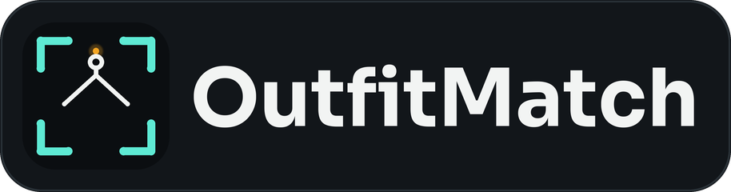
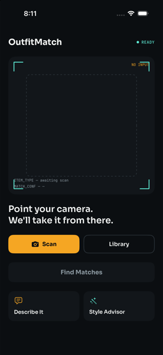
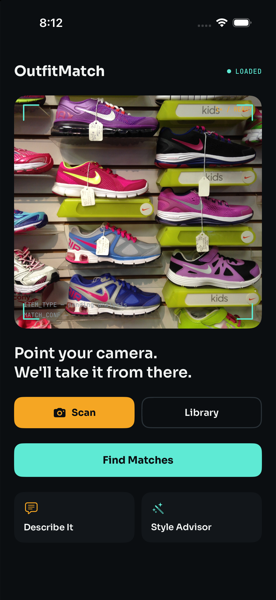
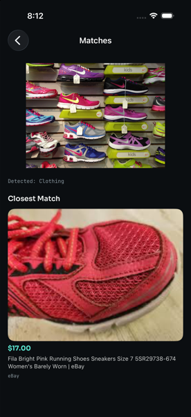
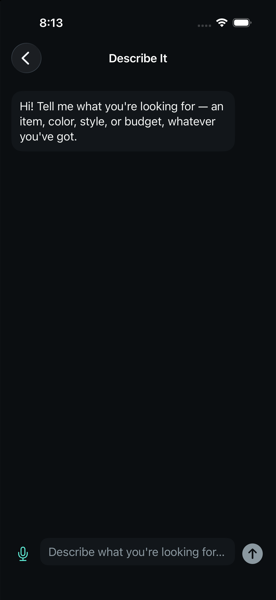
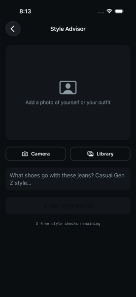
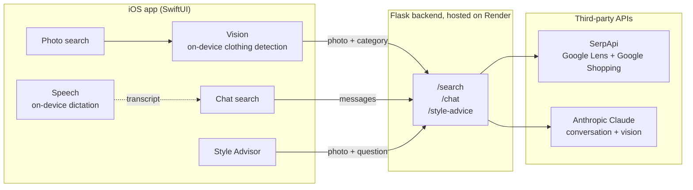

> **Portfolio project.** See [LICENSE](LICENSE) — all rights reserved,
> not licensed for reuse. [Privacy Policy](PRIVACY.md) · [Terms of Use](TERMS.md)

An iOS app: take a photo of an outfit or a single clothing item — or just
describe it in chat — and get the closest match plus genuinely cheaper
alternatives you can buy online.

The UI flow, on-device clothing detection, and product search are all real
now — search is backed by SerpApi's Google Lens (photo) and Google Shopping
(chat) APIs, and chat is powered by Claude. Both are called through a small
backend so the API keys never ship inside the app.

## Screenshots

Real screens, real results — the matches below came back from the live
backend, not mockups.

| Home | Photo loaded | Matches |
|:---:|:---:|:---:|
|  |  |  |
| The "Scan Line" home screen — a camera viewfinder as the entry point. | Photo loaded, HUD switches to `LOADED` and Find Matches activates. | Closest match with real price, retailer, and a tappable product link. |

| Describe It | Style Advisor |
|:---:|:---:|
|  |  |
| Chat search — describe the item instead of photographing it. Mic button dictates on-device. | Style Advisor (paid tier) — upload a photo, ask a styling question. |

## Tech stack

**iOS app**
- Swift, SwiftUI
- Apple **Vision** framework — on-device clothing detection ([`ClothingDetector.swift`](OutfitMatch/ClothingDetector.swift))
- Apple **Speech** framework — on-device voice-to-text for the chat mic button, no network call ([`SpeechRecognizer.swift`](OutfitMatch/SpeechRecognizer.swift))
- **StoreKit 2** — the Style Advisor subscription ([`SubscriptionManager.swift`](OutfitMatch/SubscriptionManager.swift))
- **Keychain** (Security framework) — persists the free-trial counter across reinstalls ([`StyleAdvisorAccess.swift`](OutfitMatch/StyleAdvisorAccess.swift))
- **Swift Testing** — unit tests ([`OutfitMatchTests/`](OutfitMatchTests))

**Backend**
- Python, **Flask**
- **Flask-Limiter** — per-IP rate limiting on the paid-API-calling routes
- **Gunicorn** — production WSGI server
- **Pillow** — adaptive image compression before upload
- **pytest** — unit + route tests, API calls mocked out ([`backend/tests/`](backend/tests))

**Third-party APIs**
- **[SerpApi](https://serpapi.com)** — Google Lens (photo search) and Google Shopping (chat + style advisor search)
- **[Anthropic Claude API](https://www.anthropic.com)** — the chat conversation, and vision + structured JSON outputs for Style Advisor

**Hosting / infra**
- **[Render](https://render.com)** (free tier) — backend hosting, auto-deployed from this repo via [`render.yaml`](render.yaml)
- **GitHub** — version control, CI-free (tests run locally/on demand, see [Tests](#tests))

## What works right now

1. **Home screen** — take a photo with the camera or pick one from your
   library (`CameraCapture.swift`), or describe what you want in chat
   instead (`ContentView.swift`).
2. **Clothing detection (photo path)** — the photo is analyzed on-device
   with Apple's Vision framework (`ClothingDetector.swift`) to check whether
   it actually contains clothing, and to guess what *kind* (footwear,
   outerwear, dress, top, bottom). A photo with multiple items (e.g. a
   jacket and sneakers) can surface more than one detected category.
3. **No outfit found** — if no clothing is detected in a photo, the app
   tells you instead of pretending to search.
4. **Real product search (photo path)** — the photo and detected category
   are sent to the backend, which uploads it to SerpApi's Google Lens
   API and filters results down to ones matching that category.
5. **Chat search ("Describe It")** — `ChatView.swift` has a short back-and-
   forth with Claude (via the backend's `/chat` endpoint), which asks a
   couple of clarifying questions (color, style, budget) and then runs a
   real SerpApi Google Shopping search once it has enough detail. A mic
   button lets you speak your description instead of typing it —
   `SpeechRecognizer.swift` uses Apple's on-device Speech framework (no
   network call) to stream a live transcript into the text field.
6. **Style Advisor** — `StyleAdvisorView.swift` lets you upload a photo of
   yourself or an outfit and ask a styling question (e.g. "what shoes go
   with these jeans, casual Gen Z style?"). Claude actually looks at the
   photo (vision) and returns a short styling explanation plus 2-3 concrete
   recommendations, each backed by its own real SerpApi Google Shopping
   search — via the backend's `/style-advice` endpoint.
7. **Results** — all three paths land on a closest match plus any results
   that are genuinely cheaper, shown as a photo grid (hero card + 2-column
   grid) with real thumbnails/prices, tappable to open the retailer's
   product page (`MatchesListView.swift`, shared by all three flows).
8. **Style Advisor is the paid tier** — photo search and chat search are
   free. Style Advisor gives 3 free style checks (`StyleAdvisorAccess.swift`,
   tracked locally), then requires the "Style Advisor Premium" subscription
   ($4.99/month, `SubscriptionManager.swift`, StoreKit 2). Test locally with
   `Configuration.storekit` — only works when launched from Xcode itself
   (Cmd+R), not via command-line installs.

## Known limitation: Simulator vs. real device

Vision's on-device classifier (`VNClassifyImageRequest`) does not run in the
iOS Simulator — it fails on every call regardless of the photo. Because of
this, `ClothingDetector` skips the real check when running in the Simulator
and always reports a generic "Clothing" category instead. That still lets
you test the real backend/search end-to-end in the Simulator (it hits the
real API), but **without the category hint, results are noisier** — the
backend can't filter out irrelevant matches as well. Telling clothing types
apart, correctly rejecting photos with no clothing, and getting well-filtered
search results all need a physical iPhone to test properly. (The chat path
doesn't have this limitation — it doesn't depend on Vision at all.)

## Architecture



**Client/server split.** The iOS app never talks to SerpApi or Anthropic
directly — both API keys would be trivially extractable from the app
binary otherwise. Every search and every Claude call goes through a small
Flask proxy (`backend/app.py`, deployed on Render) that holds the real
keys server-side and returns only the simplified JSON the app needs. The
app talks to exactly one thing: its own backend.

**iOS app.** SwiftUI throughout, with a deliberately light hand on
abstraction: most screens hold their own `@State` and call a stateless,
`async`/`await` service (`SearchService`, `ChatService`,
`StyleAdviceService`) directly — there's no view-model layer sitting
between them, since a screen that just needs "fetch and render" doesn't
need one. `ObservableObject` is reserved for state that actually outlives
a single screen or needs observing: `SubscriptionManager` (StoreKit 2
purchase state), `StyleAdvisorAccess` (the free-use counter), and
`SpeechRecognizer` (live mic transcription). Clothing detection
(`ClothingDetector.swift`) runs Apple's Vision framework entirely
on-device — no photo is ever sent anywhere just to check whether it
contains clothing — and degrades gracefully in the Simulator, where
Vision's classifier doesn't run at all, by falling back to a generic
category instead of crashing or silently returning nothing.

**Backend.** The Flask proxy is intentionally thin — its job is
translation and cleanup, not business logic. A few things worth calling
out:
- `compress_for_upload` adaptively downscales and re-compresses each
  photo (shrinking dimensions, then quality) in a loop until it clears
  SerpApi's 500KB upload limit, rather than hard-failing on large photos.
- Google Lens mixes unrelated priced results (stickers, gift cards) into
  its "visual matches." `is_relevant` filters those out using per-category
  keyword matching against the on-device Vision guess, with a fallback to
  unfiltered results if the filter is too aggressive and returns nothing.
- Both search paths (Lens for photos, Google Shopping for chat and style
  advice) end up needing the same ranking rule — first result is the
  closest match, anything genuinely cheaper becomes an alternative — so
  that logic lives once, in `split_exact_and_alternatives`, and both
  `to_matches` and `to_shopping_matches` call it instead of duplicating it.
- Chat and style advice both call Claude with `output_config`/JSON schema
  rather than parsing free-form text, so a malformed or chatty model
  response can't silently break the app — the response is either valid
  JSON matching the schema or the request fails loudly.

**Data flow**, one line per path:
- *Photo* → on-device Vision category guess → backend `/search` → SerpApi
  Google Lens → category-filtered, ranked results.
- *Chat* → backend `/chat` (Claude decides: ask another question, or
  search) → SerpApi Google Shopping once Claude has enough detail →
  ranked results.
- *Style Advisor* → photo + question → backend `/style-advice` → Claude
  (vision) returns advice plus 2-3 shopping queries → each query run
  through Google Shopping independently → advice and per-recommendation
  results returned together.

## Project structure

```
OutfitMatch/
├── OutfitMatchApp.swift       App entry point
├── ContentView.swift          Home screen: photo, "Describe It", "Style Advisor" entries
├── ClothingDetector.swift     On-device Vision-based clothing detection
├── Models.swift               Data models (MatchResult, ChatMessage, StyleAdvice, etc.)
├── BackendConfig.swift        Backend base URL
├── SearchService.swift        Photo search: talks to backend's /search
├── ChatService.swift          Chat search: talks to backend's /chat
├── StyleAdviceService.swift   Style advisor: talks to backend's /style-advice
├── ResultsView.swift          Results screen for the photo path
├── ChatView.swift             Chat conversation screen
├── ChatResultsView.swift      Results screen for the chat path
├── StyleAdvisorView.swift     Style advisor input screen (photo + question)
├── StyleAdviceResultsView.swift  Style advice + per-recommendation results
├── StyleAdvisorAccess.swift   Free-use counter for Style Advisor (3 free tries)
├── SubscriptionManager.swift  StoreKit 2 wrapper for the Style Advisor subscription
├── StyleAdvisorPaywallView.swift  Shown once free tries run out
├── MatchesListView.swift      Shared photo-grid results rendering (all three flows)
├── CameraCapture.swift        UIImagePickerController wrapper for camera capture
├── SpeechRecognizer.swift     On-device speech-to-text for the chat mic button
├── ScanTheme.swift            Shared "Scan Line" color/font tokens
└── ViewfinderCorners.swift    Camera-viewfinder corner-bracket decoration

OutfitMatchTests/              Unit tests (Swift Testing) — DTO decoding, free-use
                                counter, Vision-label → category mapping
OutfitMatchUITests/            UI test scaffold (XCTest)

backend/
├── app.py                   Flask proxy: /search (Lens), /chat, /style-advice (Claude + Shopping)
├── Procfile                 gunicorn start command used by Render
├── requirements.txt
├── requirements-dev.txt     Adds pytest on top of requirements.txt
├── tests/                   pytest suite for the ranking/filtering logic and routes
└── .env                     Holds API keys (gitignored, not committed)

render.yaml                   Render Blueprint — defines the hosted backend service
docs/                         Logo lockup + app screenshots used in this README
PRIVACY.md, TERMS.md          Privacy policy and terms of use
Configuration.storekit        Local StoreKit product definitions (Style Advisor Premium, $4.99/mo)
```

## Running it

**Run the app.** Open `OutfitMatch.xcodeproj` in Xcode, pick a simulator
(or your iPhone) from the run destination dropdown, and hit Run (▶).
Nothing needs to be running locally — `BackendConfig.baseURL` points at
the deployed backend, so photo search, chat, and Style Advisor all work
out of the box. The one quirk: the backend's free tier spins down after
15 minutes idle, so the first search after a quiet spell takes 30-60
seconds while it wakes back up.

**On a real device** (needed to test clothing detection properly, since
Vision doesn't run in the Simulator):
1. Connect your iPhone via USB and trust the computer.
2. Enable Developer Mode on the phone if prompted (Settings → Privacy &
   Security → Developer Mode) — this option only appears after Xcode's
   first attempt to install a build on the device.
3. Add your Apple ID under Xcode → Settings → Accounts (the free tier is
   enough for running on your own device), then select that Personal Team
   under the target's Signing & Capabilities.
4. Pick your iPhone as the run destination and hit Run.

**Working on the backend itself.** Only needed when changing backend code:
```bash
cd backend
source .venv/bin/activate   # first time: python3 -m venv .venv
pip install -r requirements.txt
python3 app.py
```
Runs on `http://127.0.0.1:5050`. Point `BackendConfig.baseURL` at it to
use it — `http://127.0.0.1:5050` from the Simulator, or the Mac's LAN IP
(e.g. `http://192.168.x.x:5050`) from a real device, since loopback on an
iPhone means the iPhone itself. `Info.plist` already permits plain-HTTP to
local-network addresses (`NSAllowsLocalNetworking`), so no extra ATS setup
is needed. Requires a `backend/.env` file with:
```
SERPAPI_KEY=your_key_here
ANTHROPIC_API_KEY=your_key_here
ANTHROPIC_WORKSPACE_ID=wrkspc_your_id_here   # only if your key is identity-linked (SSO)
```
- SerpApi: free plan, 250 searches/month — [serpapi.com](https://serpapi.com/manage-api-key)
- Anthropic: no free tier, pay-per-use (a few cents covers a lot of testing) — [console.anthropic.com](https://console.anthropic.com/settings/keys)

## Backend hosting

The backend runs on [Render](https://render.com)'s free tier at
`https://outfitmatch-backend.onrender.com`, redeploying automatically on
every push to `main`. Free tier means it sleeps after 15 minutes of
inactivity and takes 30-60 seconds to wake — fine for demos and testing,
and a $7/mo upgrade away from always-on.

[`render.yaml`](render.yaml) describes the whole service, so deploying a
fresh copy takes about two minutes:

1. Sign up at [render.com](https://render.com) — GitHub login works, no
   payment needed for the free tier.
2. **New +** → **Blueprint** → connect this repo. Render reads
   `render.yaml` and configures everything itself (Python runtime,
   `backend/` as the root directory, `gunicorn app:app` as the start
   command).
3. Fill in the three secrets when prompted — they're deliberately kept out
   of the repo: `SERPAPI_KEY`, `ANTHROPIC_API_KEY`, and
   `ANTHROPIC_WORKSPACE_ID` (leave the last blank unless your Anthropic
   key is identity-linked).
4. Point `BackendConfig.baseURL` at the HTTPS URL Render hands back.

## Tests

**iOS** — unit tests for the app's pure logic (DTO decoding, the free-use
counter, and the Vision-label → clothing-category mapping): open the
project in Xcode and hit Cmd+U, or from the command line:
```bash
xcodebuild test -project OutfitMatch.xcodeproj -scheme OutfitMatch \
  -destination 'platform=iOS Simulator,name=iPhone 17 Pro' -only-testing:OutfitMatchTests
```

**Backend** — a pytest suite covering the ranking/filtering logic
(`split_exact_and_alternatives`, `is_relevant`, `to_matches`,
`to_shopping_matches`), the adaptive image compression, and all three
routes' validation/error/success paths. Every SerpApi and Claude call is
monkeypatched out, so it runs offline with no API keys and no cost:
```bash
cd backend
source .venv/bin/activate
pip install -r requirements-dev.txt   # first time
pytest tests/ -v
```

Neither suite covers the networking layer (`SearchService`, `ChatService`,
`StyleAdviceService`) or StoreKit — those are exercised manually against
the real backend, which is the only way to catch server/client contract
drift anyway.

## Next steps

- A paid SerpApi plan before real users — the free tier's 250
  searches/month runs out quickly — plus Render's $7/mo tier to drop the
  cold starts.
- Apple Developer Program enrollment, a real StoreKit subscription
  product in App Store Connect, and TestFlight testing before any App
  Store submission.
- Real-device testing of clothing detection (Vision doesn't run in the
  Simulator — see the limitation noted above).
- An accessibility pass beyond the VoiceOver labels already in place
  (Dynamic Type, more thorough VoiceOver testing).
